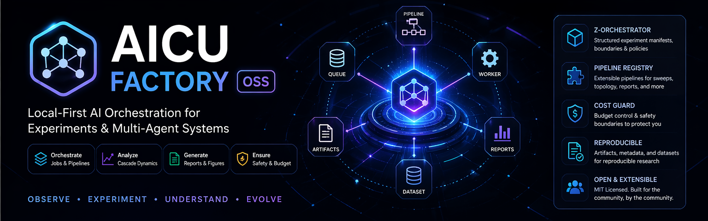
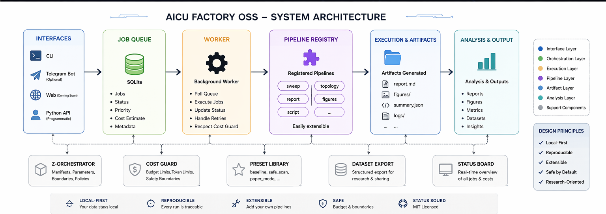

# AICU Factory OSS

**Local-first orchestration for AI experiments, multi-agent workflows, and reproducible research pipelines.**

AICU Factory OSS is a lightweight execution core for builders and researchers who want structured jobs, background workers, reusable pipelines, exportable artifacts, and paper-friendly run organization without heavy infrastructure.

## What this project is

AICU Factory OSS sits between raw scripts and full production systems.

It gives you a clean layer for:
- queueing jobs
- running workers
- registering pipelines
- organizing artifacts
- validating manifests
- exporting datasets

The goal is simple: turn messy AI experiments into reproducible workflows.

## Core capabilities

### Orchestration core
- Local-first SQLite job queue
- Background worker execution
- Structured artifacts for reports, figures, and summaries

### Pipeline registry
Built-in pipeline families include:
- `sweep`
- `topology`
- `report`
- `figures`
- `script`

### Z-Orchestrator scaffold
Integrated manifest-based project structure with:
- presets
- safety boundaries
- repair policies
- run layouts

### Presets
- `baseline`
- `safe_scan`
- `paper_mode`

### Cost guard
Use environment limits to pause expensive jobs before they run.

### Dataset support
Export structured experiment outputs for analysis, sharing, and research packaging.

## Architecture



## Quick start

```bash
python -m venv .venv
.\.venv\Scriptsctivate
pip install -r requirements.txt
copy .env.example .env

python -m aicu_factory.cli init
python -m aicu_factory.cli add-demo
python -m aicu_factory.cli run
python -m aicu_factory.cli status
```

## Z-Orchestrator workflow

```bash
python -m aicu_factory.cli z-init-project v018_fss
python -m aicu_factory.cli z-validate workspace/projects/v018_fss/manifests/baseline.json --preset safe_scan
python -m aicu_factory.cli z-run workspace/projects/v018_fss/manifests/baseline.json --preset paper_mode
```

## Project layout

```text
assets/                Visual assets for GitHub and docs
research/              Paper-facing drafts and protocol notes
web/                   Minimal landing page scaffold

workspace/             Generated locally after init / runs
aicu_factory/          Core package
scripts/               Dataset utilities
examples/              Sample pipeline code
data/                  Schemas and example data
```

## Research alignment

This repo includes a small research-facing scaffold in `research/`:
- `paper_draft.md`
- `dataset_schema.json`
- `experiment_protocol.md`

These files are not final papers. They are clean starting points for turning AICU Factory runs into reproducible study packages.

## Privacy and safety

This public package is intended to stay clean:
- no embedded secrets
- no bundled databases
- no historical logs or private run outputs
- no mandatory telemetry

Keep `.env`, local databases, logs, and generated workspaces out of Git.

## Contribution directions

Useful community contributions include:
- new pipeline types
- new presets
- manifest templates
- dataset validation improvements
- documentation and examples

## License

MIT License

## Why this matters

AICU Factory OSS is meant to be a practical kernel for people building experiment-heavy AI systems. It is lightweight enough for independent researchers, but structured enough to evolve into larger orchestration stacks.
